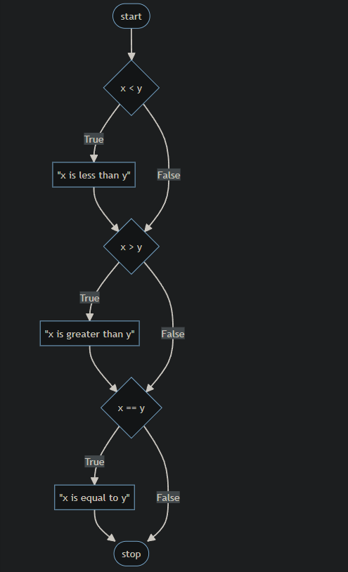
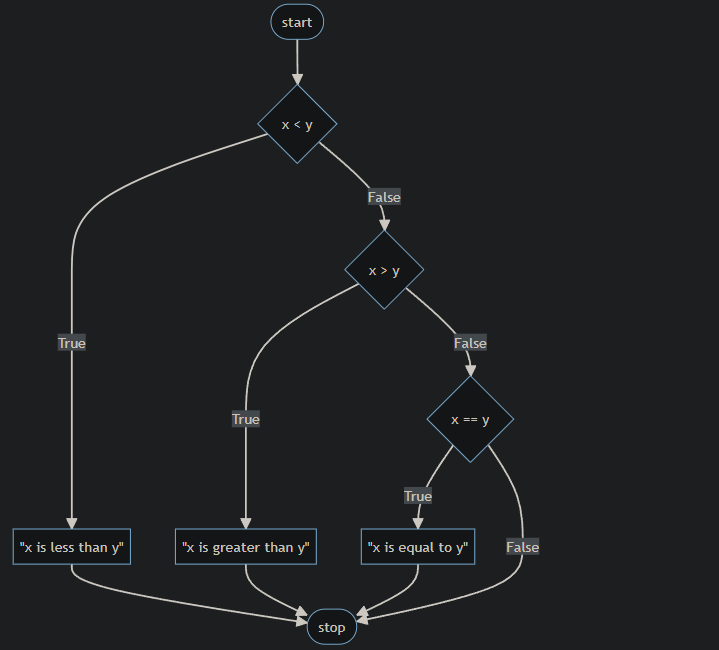
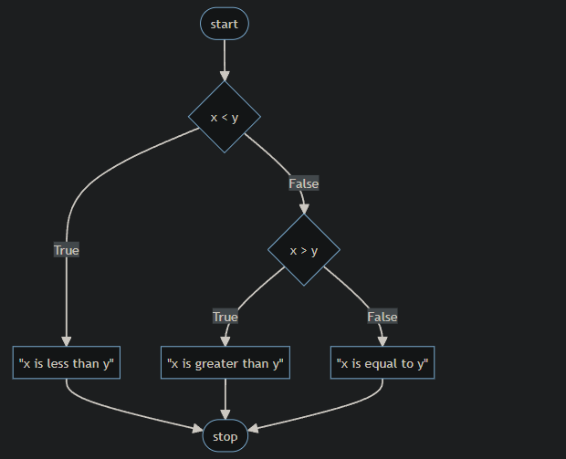
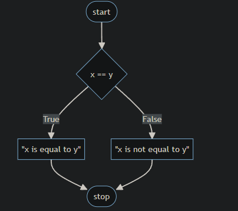

# Lectura 1

## Condicionales

### Sentencias if

### Flujo de control, elif y else

### or

### and

### Módulo

### Creando nuestra propia función de paridad

### Pythonic

### match

### Resumiendo

## Condicionales

Los condicionales permiten que tú, el programador, le permitas a tu programa tomar decisiones: como si tu programa tuviera la opción de tomar el camino de la izquierda o el de la derecha basado en ciertas condiciones.
Dentro de Python hay un conjunto de "operadores" que se usan para hacer preguntas matemáticas.

```markdown
> y < probablemente te resulten familiares.
> = denota "mayor o igual que".
> <= denota "menor o igual que".
> == denota "igual a", ¡aunque observa el doble signo igual! Un solo signo igual asignaría un valor. Los dobles signos iguales se usan para comparar variables.
> != denota "distinto de".
> Las sentencias condicionales comparan un término de la izquierda con un término de la derecha.
```

## Sentencias if

En tu terminal, escribe `code compare.py`. Esto creará un nuevo archivo llamado "compare".
En la ventana del editor de texto, comienza con lo siguiente:

```python
x = int(input("¿Qué es x? "))
y = int(input("¿Qué es y? "))

if x < y:
    print("x es menor que y")
```

Observa cómo tu programa toma la entrada del usuario para x e y, convirtiéndolos a enteros y guardándolos en sus respectivas variables x e y. Luego, la sentencia if compara x e y. Si se cumple la condición de x < y, se ejecuta la sentencia print.

Las sentencias if usan valores bool o booleanos (true o false) para decidir si ejecutar o no. Si la sentencia de x > y es verdadera, el compilador la registrará como true y ejecutará el código.

## Flujo de control, elif y else

Revisa tu código de la siguiente manera:

```python
x = int(input("¿Qué es x? "))
y = int(input("¿Qué es y? "))

if x < y:
    print("x es menor que y")
if x > y:
    print("x es mayor que y")
if x == y:
    print("x es igual a y")
```

Observa cómo estás proporcionando una serie de sentencias if. Primero se evalúa la primera sentencia if. Luego, la segunda sentencia if ejecuta su evaluación. Finalmente, la última sentencia if ejecuta su evaluación. Este flujo de decisiones se llama "flujo de control".

Nuestro código se puede representar de la siguiente manera:



Este programa se puede mejorar evitando hacer tres preguntas consecutivas. Después de todo, ¡no todas las preguntas pueden tener un resultado verdadero! Revisa tu programa de la siguiente manera:

```python
x = int(input("¿Qué es x? "))
y = int(input("¿Qué es y? "))

if x < y:
    print("x es menor que y")
elif x > y:
    print("x es mayor que y")
elif x == y:
    print("x es igual a y")
```

Observa cómo el uso de elif permite al programa tomar menos decisiones. Primero se evalúa la sentencia if. Si esta sentencia resulta ser verdadera, no se ejecutarán todas las sentencias elif. Sin embargo, si la sentencia if se evalúa y resulta falsa, se evaluará el primer elif. Si esto es verdadero, no se ejecutará la evaluación final.

Nuestro código se puede representar de la siguiente manera:



Aunque tu computadora no note una diferencia en velocidad entre nuestro primer programa y este programa revisado, considera cómo un servidor en línea que ejecuta miles de millones o billones de estos tipos de cálculos cada día podría verse definitivamente afectado por una decisión de codificación tan pequeña.
Hay una última mejora que podemos hacer a nuestro programa. Observa cómo lógicamente elif x == y no es una evaluación necesaria de ejecutar. Después de todo, si lógicamente x no es menor que y Y x no es mayor que y, x DEBE ser igual a y. Por lo tanto, no tenemos que ejecutar elif x == y. Podemos crear un resultado predeterminado usando una sentencia else. Podemos revisar de la siguiente manera:

```python
x = int(input("¿Qué es x? "))
y = int(input("¿Qué es y? "))

if x < y:
    print("x es menor que y")
elif x > y:
    print("x es mayor que y")
else:
    print("x es igual a y")
```

Observa cómo la complejidad relativa de este programa ha disminuido a través de nuestra revisión.

Nuestro código se puede representar de la siguiente manera:



## or

or permite que tu programa decida entre una o más alternativas. Por ejemplo, podríamos editar aún más nuestro programa de la siguiente manera:

```python
x = int(input("¿Qué es x? "))
y = int(input("¿Qué es y? "))

if x < y or x > y:
    print("x no es igual a y")
else:
    print("x es igual a y")
```

Observa que el resultado de nuestro programa es el mismo, pero la complejidad ha disminuido. La eficiencia de nuestro código ha aumentado.

En este punto, nuestro código es bastante bueno. Sin embargo, ¿podría mejorarse aún más el diseño? Podríamos editar aún más nuestro código de la siguiente manera:

```python
x = int(input("¿Qué es x? "))
y = int(input("¿Qué es y? "))

if x != y:
    print("x no es igual a y")
else:
    print("x es igual a y")
```

Observa cómo eliminamos el or por completo y simplemente preguntamos: "¿x no es igual a y?" Hacemos una y solo una pregunta. ¡Muy eficiente!

Para el propósito de la ilustración, también podríamos cambiar nuestro código de la siguiente manera:

```python
x = int(input("¿Qué es x? "))
y = int(input("¿Qué es y? "))

if x == y:
    print("x es igual a y")
else:
    print("x no es igual a y")
```

Observa que el operador == evalúa si lo que está a la izquierda y a la derecha son iguales entre sí. El uso de dobles signos iguales es muy importante. Si usas solo un signo igual, es probable que el compilador arroje un error.

Nuestro código se puede ilustrar de la siguiente manera:



## and

Similar a or, and se puede usar dentro de las sentencias condicionales.
Ejecuta en la ventana de la terminal `code grade.py`. Comienza tu nuevo programa de la siguiente manera:

```python
score = int(input("Puntaje: "))

if score >= 90 and score <= 100:
    print("Calificación: A")
elif score >= 80 and score < 90:
    print("Calificación: B")
elif score >= 70 and score < 80:
    print("Calificación: C")
elif score >= 60 and score < 70:
    print("Calificación: D")
else:
    print("Calificación: F")
```

Observa que al ejecutar `python grade.py`, podrás ingresar un puntaje y obtener una calificación. Sin embargo, observa cómo hay potencial para errores.

Típicamente, no queremos confiar en nuestros usuarios para que ingresen la información correcta. Podríamos mejorar nuestro código de la siguiente manera:

```python
score = int(input("Puntaje: "))

if 90 <= score <= 100:
    print("Calificación: A")
elif 80 <= score < 90:
    print("Calificación: B")
elif 70 <= score < 80:
    print("Calificación: C")
elif 60 <= score < 70:
    print("Calificación: D")
else:
    print("Calificación: F")
```

Observa cómo Python te permite encadenar los operadores y condiciones de una manera bastante inusual para otros lenguajes de programación.

Aún así, podemos mejorar aún más nuestro programa:

```python
score = int(input("Puntaje: "))

if score >= 90:
    print("Calificación: A")
elif score >= 80:
    print("Calificación: B")
elif score >= 70:
    print("Calificación: C")
elif score >= 60:
    print("Calificación: D")
else:
    print("Calificación: F")
```

Observa cómo el programa se mejora al hacer menos preguntas. Esto hace que nuestro programa sea más fácil de leer y mucho más mantenible en el futuro.

Puedes aprender más en la documentación de Python sobre el flujo de control.

## Módulo

En matemáticas, la paridad se refiere a si un número es par o impar.
El

operador módulo % en programación permite ver si dos números se dividen de manera uniforme o si tienen un residuo.
Por ejemplo, 4 % 2 resultaría en cero, porque se divide uniformemente. Sin embargo, 3 % 2 no se divide uniformemente y resultaría en un número distinto de cero.
En la ventana de la terminal, crea un nuevo programa escribiendo `code parity.py`. En la ventana del editor de texto, escribe tu código de la siguiente manera:

```python
x = int(input("¿Qué es x? "))

if x % 2 == 0:
    print("Par")
else:
    print("Impar")
```

Observa cómo nuestros usuarios pueden ingresar cualquier número 1 o mayor para ver si es par o impar.

## Creando nuestra propia función de paridad

Como se discutió en la Lectura 0, te resultará útil crear una función propia.
Podemos crear nuestra propia función para verificar si un número es par o impar. Ajusta tu código de la siguiente manera:

```python
def main():
    x = int(input("¿Qué es x? "))
    if is_even(x):
        print("Par")
    else:
        print("Impar")

def is_even(n):
    if n % 2 == 0:
        return True
    else:
        return False

main()
```

Observa que nuestra sentencia if `is_even(x)` funciona aunque no haya un operador allí. Esto se debe a que nuestra función devuelve un bool (o booleano), true o false, de vuelta a la función principal. La sentencia if simplemente evalúa si `is_even` de x es verdadero o falso.

## Pythonic

En el mundo de la programación, hay tipos de programación que se llaman de naturaleza "Pythonic". Es decir, hay maneras de programar que a veces solo se ven en la programación en Python. Considera la siguiente revisión de nuestro programa:

```python
def main():
    x = int(input("¿Qué es x? "))
    if is_even(x):
        print("Par")
    else:
        print("Impar")

def is_even(n):
    return True if n % 2 == 0 else False

main()
```

Observa que esta sentencia return en nuestro código es casi como una frase en inglés. Esta es una manera única de codificar que solo se ve en Python.

Podemos revisar aún más nuestro código y hacerlo cada vez más legible:

```python
def main():
    x = int(input("¿Qué es x? "))
    if is_even(x):
        print("Par")
    else:
        print("Impar")

def is_even(n):
    return n % 2 == 0

main()
```

Observa que el programa evaluará lo que está sucediendo dentro de `n % 2 == 0` como verdadero o falso y simplemente devolverá eso a la función principal.

## match

Similar a las sentencias if, elif y else, las sentencias match se pueden usar para ejecutar condicionalmente el código que coincide con ciertos valores.
Considera el siguiente programa:

```python
name = input("¿Cuál es tu nombre? ")

if name == "Harry":
    print("Gryffindor")
elif name == "Hermione":
    print("Gryffindor")
elif name == "Ron":
    print("Gryffindor")
elif name == "Draco":
    print("Slytherin")
else:
    print("¿Quién?")
```

Observa que las primeras tres sentencias condicionales imprimen la misma respuesta.

Podemos mejorar este código ligeramente con el uso de la palabra clave or:

```python
name = input("¿Cuál es tu nombre? ")

if name == "Harry" or name == "Hermione" or name == "Ron":
    print("Gryffindor")
elif name == "Draco":
    print("Slytherin")
else:
    print("¿Quién?")
```

Observa que el número de sentencias elif ha disminuido, mejorando la legibilidad de nuestro código.

Alternativamente, podemos usar sentencias match para mapear nombres a casas. Considera el siguiente código:

```python
name = input("¿Cuál es tu nombre? ")

match name:
    case "Harry":
        print("Gryffindor")
    case "Hermione":
        print("Gryffindor")
    case "Ron":
        print("Gryffindor")
    case "Draco":
        print("Slytherin")
    case _:
        print("¿Quién?")
```

Observa el uso del símbolo \_ en el último caso. Esto coincidirá con cualquier entrada, resultando en un comportamiento similar a una sentencia else.

Una sentencia match compara el valor que sigue a la palabra clave match con cada uno de los valores que siguen a las palabras clave case. En caso de que se encuentre una coincidencia, se ejecuta la sección de código correspondiente con sangría y el programa detiene la coincidencia.

Podemos mejorar el código:

```python
name = input("¿Cuál es tu nombre? ")

match name:
    case "Harry" | "Hermione" | "Ron":
        print("Gryffindor")
    case "Draco":
        print("Slytherin")
    case _:
        print("¿Quién?")
```

Observa el uso de la barra vertical simple |. Al igual que la palabra clave or, esto nos permite verificar varios valores en la misma sentencia case.

## Resumiendo

Ahora tienes el poder dentro de Python para usar sentencias condicionales para hacer preguntas y que tu programa actúe en consecuencia. En esta lectura, discutimos...

- Condicionales;
- Sentencias if;
- Flujo de control, elif y else;
- or;
- and;
- Módulo;
- Crear tu propia función;
- Programación Pythonic;
- y match.
